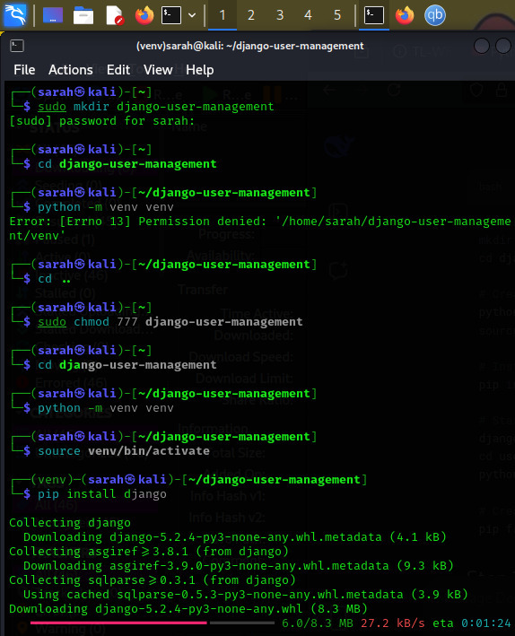
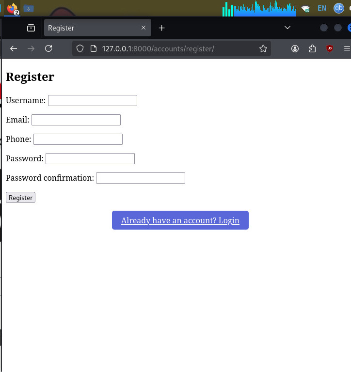
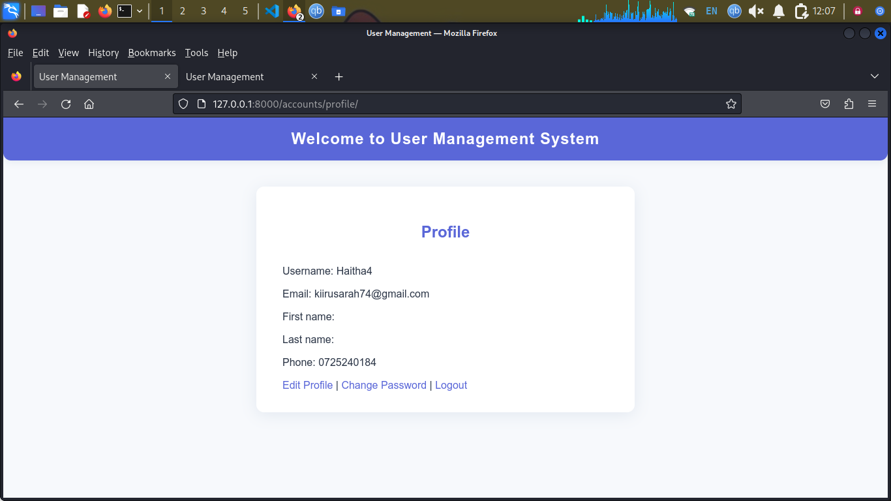
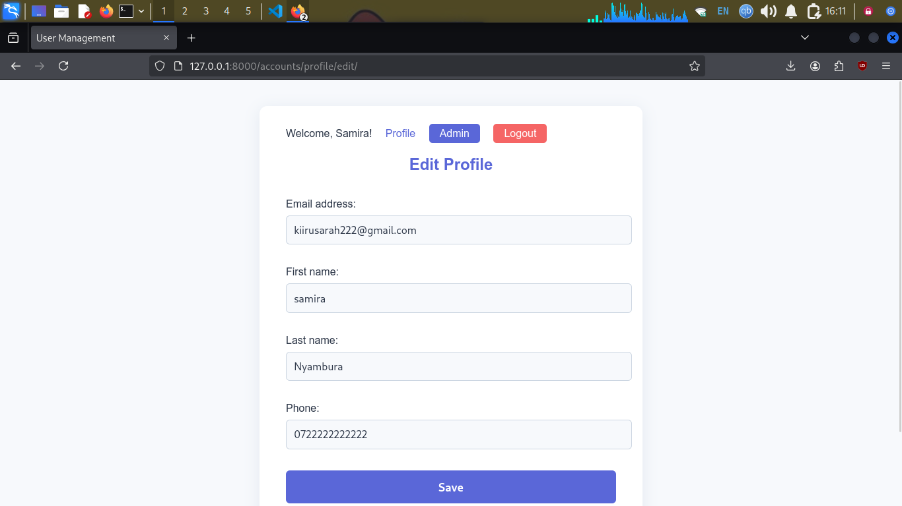
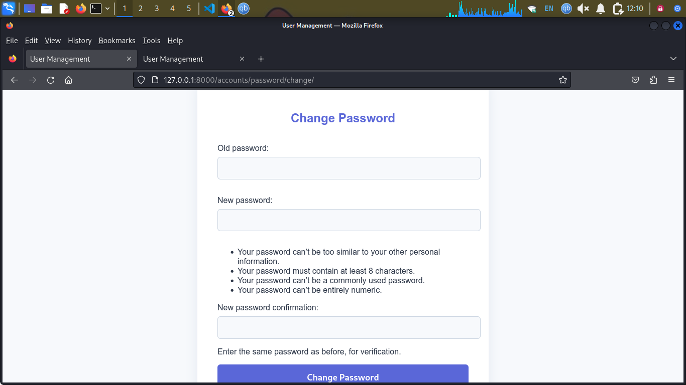
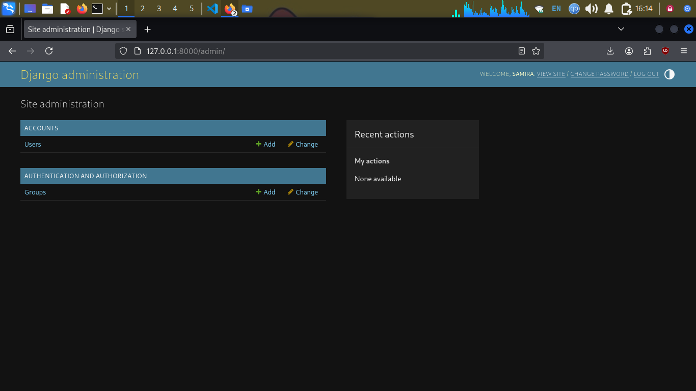

# Django User Management

A friendly, modern Django app for user registration, login, profile management, and admin control.

## Installation

1. **Clone the repository:**
   ```sh
   git clone <repo-url>
   cd django-user-management
   ```
2. **Create and activate a virtual environment:**
   ```sh
   python3 -m venv venv
   source venv/bin/activate
   ```
3. **Install dependencies:**
   ```sh
   pip install -r requirements.txt
   ```
4. **Run migrations:**
   ```sh
   python manage.py migrate
   ```
5. **Create a superuser:**
   ```sh
   python manage.py createsuperuser
   ```

## Running the Project

Start the development server:
```sh
python manage.py runserver
```
Visit [http://127.0.0.1:8000/](http://127.0.0.1:8000/) in your browser.

## Features
- User registration with email verification (mocked)
- Login and logout
- Profile view and edit
- Change password
- Django admin panel for user management
- Permission restrictions for normal users
- Friendly, modern UI


### Project Setup


### Registration Page


### Login Page


### Profile View


### Edit Profile


### Change Password


### Admin Panel


## Testing

Run all tests with:
```sh
python manage.py test accounts
```

## License

MIT License