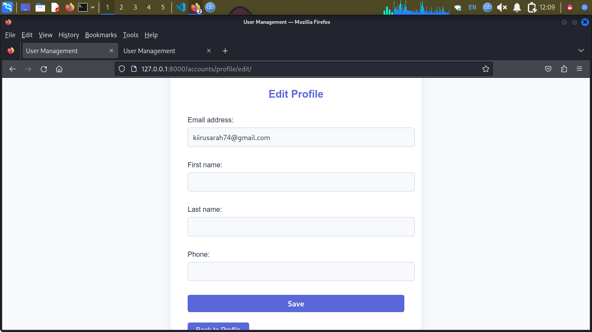

# Django User Management

A friendly, modern Django app for user registration, login, profile management, and admin control.

## Installation

1. **Clone the repository:**
   ```sh
   git clone <repo-url>
   cd django-user-management
   ```
2. **Create and activate a virtual environment:**
   ```sh
   python3 -m venv venv
   source venv/bin/activate
   ```
3. **Install dependencies:**
   ```sh
   pip install -r requirements.txt
   ```
4. **Run migrations:**
   ```sh
   python manage.py migrate
   ```
5. **Create a superuser:**
   ```sh
   python manage.py createsuperuser
   ```

## Running the Project

Start the development server:
```sh
python manage.py runserver
```
Visit [http://127.0.0.1:8000/](http://127.0.0.1:8000/) in your browser.

## Features
- User registration with email verification (mocked)
- Login and logout
- Profile view and edit
- Change password
- Django admin panel for user management
- Permission restrictions for normal users
- Friendly, modern UI


### Project Setup


### Registration Page


### Login Page


### Profile View


### Edit Profile


### Change Password


### Admin Panel


## Testing

Run all tests with:
```sh
python manage.py test accounts
```

## License

MIT License

## Project File Overview

- **manage.py**: Django's command-line utility for administrative tasks (runserver, migrate, createsuperuser, etc).
- **requirements.txt**: Lists all Python dependencies needed to run the project.
- **README.md**: Project documentation, setup instructions, and screenshots.
- **usermanagement/**: Main Django project folder.
  - **__init__.py**: Marks this directory as a Python package.
  - **settings.py**: Main configuration file (database, installed apps, email, etc).
  - **urls.py**: Root URL configuration for the project.
  - **wsgi.py**: WSGI entry point for deployment.
  - **asgi.py**: ASGI entry point for async servers.
- **accounts/**: Main app for user management.
  - **admin.py**: Registers custom user model and other models with Django admin.
  - **apps.py**: App configuration.
  - **forms.py**: Custom forms for registration, profile editing, and password change.
  - **models.py**: Custom user model and any additional models.
  - **views.py**: All logic for registration, login, profile, email verification, etc.
  - **urls.py**: URL patterns for user-related pages (register, login, profile, etc).
  - **templates/accounts/**: HTML templates for all user pages (register, login, profile, etc).
  - **migrations/**: Database migration files for the app.
  - **tests.py**: Automated tests for user features.
- **static/**: (If present) Static files like CSS, JS, images.
- **db.sqlite3**: SQLite database file (created after running migrations).